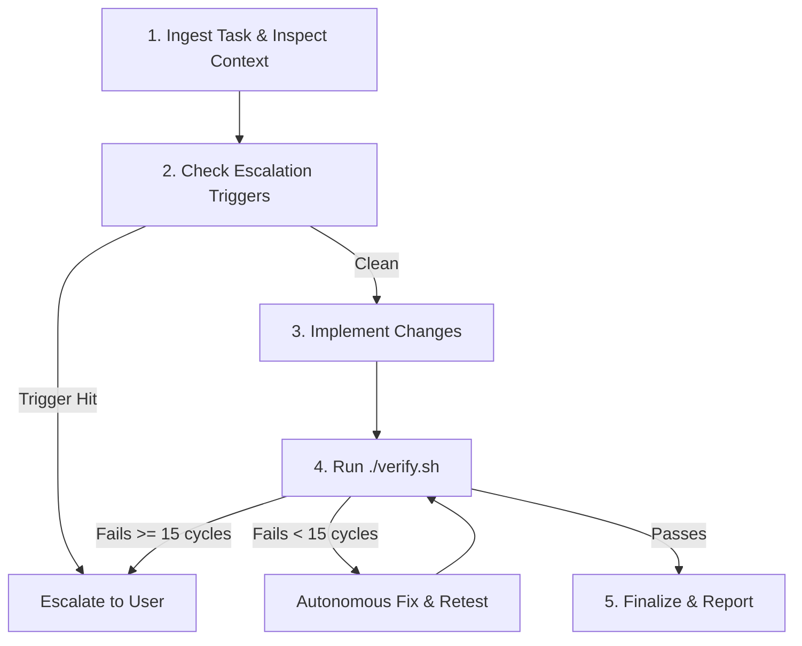

# AGENTS: Autonomous Agent Execution Directives

This document is the root directive governing every AI agent operating within the E.R.I.C.A. workspace. All agents MUST adhere to the execution loop and governance bindings specified herein.

---

## 1. Governance Binding

Every agent action is constrained by three foundational governance artifacts:

1. **[`LAWS.md`](file:///Users/zyndrex/ERICA-sandbox/LAWS.md)**: Non-negotiable system invariants and immutability rules.
   - **Constraint:** Files in `tests/laws/` (and `test/laws/`) and [`LAWS.md`](file:///Users/zyndrex/ERICA-sandbox/LAWS.md) are strictly **immutable and read-only**. You must NEVER modify, weaken, or delete them.
2. **[`PRINCIPLES.md`](file:///Users/zyndrex/ERICA-sandbox/PRINCIPLES.md)**: Engineering defaults and escalation triggers.
   - **Constraint:** Stop and prompt the user before:
     - Adding or upgrading any external dependency (npm, Gradle, Pods).
     - Modifying public API contracts, exported bridges, or domain service interfaces.
     - Changing database schemas, SQLite migrations, or storage layouts.
   - **Code Standards:** Explicit domain errors over silent nulls, no premature single-use abstractions, and zero untyped bypasses (`any`, `@ts-ignore`, unchecked assertions).
3. **[`HARNESS.md`](file:///Users/zyndrex/ERICA-sandbox/HARNESS.md)**: Verification toolchain and autonomous iteration protocol.
   - **Constraint:** Always run [`./verify.sh`](file:///Users/zyndrex/ERICA-sandbox/verify.sh) to validate changes. Attempt up to **15 autonomous fix iterations** before escalating failures to the user.

---

## 2. Agent Execution Loop

Whenever assigned a task, follow this strict 5-stage loop:

### Stage 1: Ingest & Contextualize
- Inspect existing codebase conventions, relevant ADRs in `docs/adr/`, and related test files.
- Verify whether the task touches any invariant governed by [`LAWS.md`](file:///Users/zyndrex/ERICA-sandbox/LAWS.md).

### Stage 2: Pre-Execution Principle Check
- Check proposed changes against the Escalation Triggers in [`PRINCIPLES.md`](file:///Users/zyndrex/ERICA-sandbox/PRINCIPLES.md).
- If external dependencies, schema changes, or public API modifications are necessary, prompt the user first.

### Stage 3: Implementation
- Implement minimal, robust code adhering to:
  - Explicit error handling over null fallbacks.
  - Zero `any` or type-assertion bypasses.
  - Secure memory zeroing for cryptographic secrets.

### Stage 4: Verification Pipeline
- Execute [`./verify.sh`](file:///Users/zyndrex/ERICA-sandbox/verify.sh).
- If errors occur, diagnose and repair them autonomously. You have a budget of up to 15 execution cycles.
- Do not ask the user for permission to fix standard test or compilation errors during this loop.

### Stage 5: Completion & Delivery
- Confirm [`./verify.sh`](file:///Users/zyndrex/ERICA-sandbox/verify.sh) exits with code 0.
- Report results concisely with clickable markdown file links (`file://...`).
